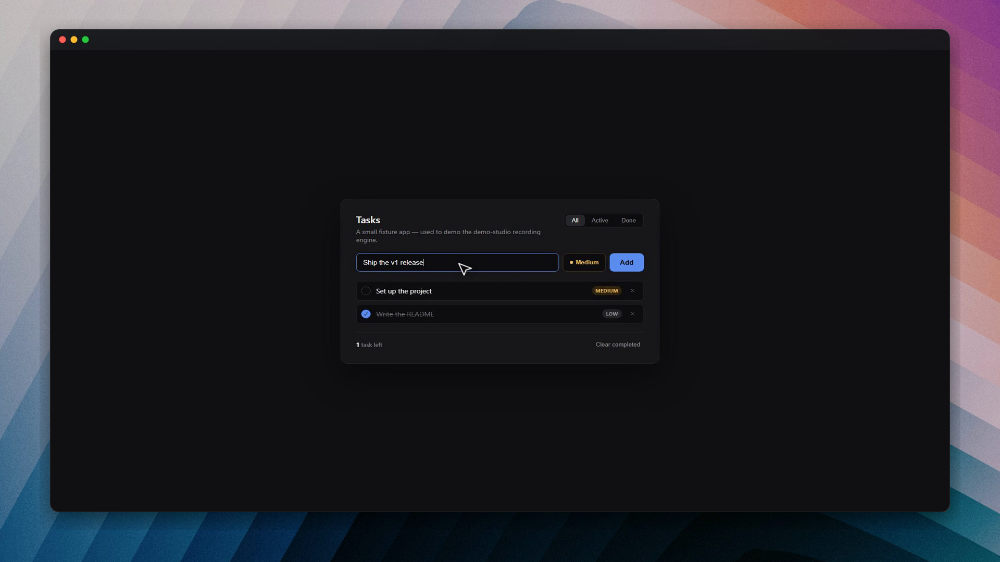

# demo-studio

**Polished product demos — recorded by your AI agent.**

No video editor. No manual screen recording. Tag a skill in Cursor or Claude Code, describe what to show, and get back a zoom-composited `.mp4` with optional voiceover and burned-in captions.

The launch clip below was **produced by this repo's own [`produce-video`](skills/produce-video/SKILL.md) skill** — narrated, captioned, zero hand-editing. Click the image to play (51s, audio on):

[](https://github.com/AlexAnsart/demo-studio/blob/main/docs/assets/promo.mp4)

The preview it delivers inside that session was recorded the same way with [`film-demo`](skills/film-demo/SKILL.md):


---

## Why not just screen-record?

| Manual recording | demo-studio |
|------------------|-------------|
| You drive every click | Agent drives Playwright from a script |
| Zooms added in post | Smart focus/wide camera baked in |
| Voice + sync in a DAW | ElevenLabs + Whisper alignment automated |
| Every take is different | Guardrails + verify loop before delivery |

Works on **any web app** — Vite, Next.js, your own stack. One install, five skills.

---

## Quick start

**1. Install** (in your project, or clone this repo to try the [hello fixture](examples/hello-demo)):

```bash
npx skills add AlexAnsart/demo-studio --all --agent cursor --copy -y
```

**2. Set up once** — in Cursor chat:

> @demo-setup Set up demo-studio for this project.

This creates `demo.config.json` at your project root (from [`demo.config.example.json`](demo.config.example.json)).

**3. Record** — silent demo:

> @film-demo Record a silent demo of the signup flow. Save to `demos/signup/demo.mp4`.

Or full narrated pipeline (needs `ELEVENLABS_API_KEY` in `.env`):

> @produce-video Produce a narrated demo of creating a task — voiceover and captions — save to `demos/create-task/demo.mp4`.

The agent writes the beat script, records the browser, composes zooms, runs quality checks, and delivers the file. You don't run ffmpeg or Playwright commands yourself.

---

## Skills

| Skill | Role |
|-------|------|
| [demo-setup](skills/demo-setup) | One-time project config — dev server, auth, narration, scaffolds your first demo |
| [film-demo](skills/film-demo) | Silent capture — Playwright, cursor, zone zooms, speed-ups, styled frame |
| [narrate](skills/narrate) | ElevenLabs voiceover from your script |
| [sync-narration](skills/sync-narration) | Whisper alignment, pause insertion, caption burn-in |
| [produce-video](skills/produce-video) | End-to-end orchestrator — all of the above in one run |

---

## How it works

```
Your prompt  →  script.md (Say + Show beats)
                    ↓
              narrate (optional)  →  narration.mp3
                    ↓
              film-demo           →  silent .mp4 (smart zooms, guardrails)
                    ↓
              sync-narration      →  final .mp4 + captions
```

**Voice comes first** when narrated: the video adapts to the voice, not the other way around.

---

## Requirements

| Tool | Needed for |
|------|------------|
| Node.js 18+ | Recording engine |
| [ffmpeg](https://ffmpeg.org/download.html) + `ffprobe` | Compose, sync, captions |
| Python 3.9+ | Narration sync (Whisper) |
| [ElevenLabs](https://elevenlabs.io) API key | Voiceover only — silent mode works without it |

Copy [`.env.example`](.env.example) → `.env` for `ELEVENLABS_API_KEY` and optional demo login credentials.

---

## Try the hello fixture

No dev server required — use this repo directly:

```bash
npx skills add AlexAnsart/demo-studio --all --agent cursor --copy -y
```

Then in Cursor:

> @demo-setup Set up demo-studio. Use the hello fixture in `examples/hello-demo/app`.
>
> @film-demo Record a silent demo: type "Ship the v1 release", click Add, show the new task. Save to `examples/hello-demo/output/demo.mp4`.

---

## Configuration

All tunables live in **`demo.config.json`** at your project root. The `demo-setup` skill generates it; you can also copy [`demo.config.example.json`](demo.config.example.json) and edit by hand.

**Field-by-field reference:** [docs/CONFIG.md](docs/CONFIG.md)

Every field has a safe default in `skills/film-demo/scripts/config.mjs` — a partial or empty file still works.

### Where settings apply

| Layer | What you set | When to use |
|-------|--------------|-------------|
| **`demo.config.json`** | Project-wide defaults (cursor, camera, frame preset, voice, …) | Once per repo — the agent reads this on every run |
| **Agent prompt** | One-off instructions (“use macos-dark”, “save to …”) | Per demo |
| **`compose.mjs` CLI flags** | Frame overrides for a single render dir | Manual re-compose or debugging |
| **`presets.mjs`** | New named looks (copy an existing preset entry) | When you want a reusable custom style |

### Config sections at a glance

| Section | Controls |
|---------|----------|
| `app` | Base URL, dev command (doc only), recording viewport (`1920×1080` default) |
| `auth` | Optional off-camera login — selectors + env var **names** for credentials |
| `cursor` | Pointer size (`scale`) and color |
| `camera` | Zone padding, max zoom, default pan/zoom duration |
| `speedup` | How long waits/spinners/idle gaps are compressed (set `idleGapMin` very high for narrated demos) |
| `frame` | Output size, preset, wallpaper, corner radius, title bar |
| `narration` | `none` or `elevenlabs` — voice, model, API key env var name |
| `captions` | Burn-in on/off, line length |
| `output` | Default folder for scaffolded demos (`demos/`) |

### Minimal config example

```json
{
  "app": { "baseUrl": "http://localhost:5173", "devCommand": "npm run dev" },
  "frame": { "preset": "macos-dark", "wallpaper": "photo-beach-tropical" },
  "narration": { "provider": "elevenlabs" }
}
```

Only the fields you set override defaults; everything else falls back to `config.mjs`.

---

## Window design (styled frame)

The **styled frame** is the border around your recording: background (solid color or wallpaper), optional rounded corners, drop shadow, and an optional macOS-style title bar with red / amber / green traffic-light dots.



Light variant: [`docs/assets/window-chrome-macos-light.png`](docs/assets/window-chrome-macos-light.png)

### Frame presets

Set `frame.preset` in `demo.config.json`, or pass `--preset` to `compose.mjs`.

| Preset | Look |
|--------|------|
| `studio-dark` **(default)** | Near-black padding, subtle shadow, **square** corners, no wallpaper |
| `clean-light` | Off-white padding, faint shadow, square corners |
| `none` | No background/shadow — border only |
| `rounded-dark` | Like `studio-dark` but **rounded corners** (18px), no wallpaper/title bar |
| `macos-dark` | Wallpaper + rounded corners + **dark title bar** + traffic-light dots |
| `macos-light` | Wallpaper + rounded corners + **light title bar** + traffic-light dots |

Built-in macOS presets ship with these defaults (`skills/film-demo/scripts/presets.mjs`):

| Preset | Default wallpaper | Dim overlay |
|--------|-------------------|-------------|
| `macos-dark` | `wave-purple-pink` (abstract gradient) | 0.20 |
| `macos-light` | `wave-blue-minimal` (soft blue) | 0.08 |

Swap the wallpaper to any bundled name or your own image — the preset only sets the starting point.

### Frame fields in `demo.config.json`

| Field | Default | Effect |
|-------|---------|--------|
| `frame.preset` | `studio-dark` | One of the presets above |
| `frame.canvasWidth` / `canvasHeight` | `1920` / `1080` | Final export resolution — keep in sync with `app.viewport` |
| `frame.wallpaper` | `null` | Bundled name (no extension) or path to your own image |
| `frame.radius` | `0` | Window corner radius in px — overrides the preset when set |
| `frame.titlebarHeight` | `0` | Title bar height in px — `0` = none; overrides preset when set |
| `frame.trafficLights` | `true` | Show/hide the three dots when a title bar is present |

**Example — aerial beach behind a dark macOS window:**

```json
"frame": {
  "preset": "macos-dark",
  "wallpaper": "photo-beach-tropical"
}
```

**Example — rounded corners only, no wallpaper:**

```json
"frame": {
  "preset": "rounded-dark"
}
```

### Compose CLI (per-render overrides)

After recording, `film-demo` runs `compose.mjs` on the render folder (`raw.mp4`, camera plan, etc.). You can re-run compose manually with extra flags:

```bash
node skills/film-demo/scripts/compose.mjs <renderDir> --preset macos-dark

# Swap wallpaper
node skills/film-demo/scripts/compose.mjs <renderDir> \
  --preset macos-dark --wallpaper photo-beach-tropical

# Build chrome piecemeal from a plain preset
node skills/film-demo/scripts/compose.mjs <renderDir> \
  --preset studio-dark \
  --wallpaper ribbon-indigo --wallpaper-dim 0.5 --radius 28

# Title bar + custom dot colors, no wallpaper
node skills/film-demo/scripts/compose.mjs <renderDir> \
  --preset studio-dark \
  --radius 18 --titlebar \
  --titlebar-color "rgba(30,30,36,0.95)" \
  --traffic-light-colors "#ff5f57,#febc2e,#28c840"
```

| Flag | Default | Notes |
|------|---------|-------|
| `--preset <name>` | `studio-dark` | Base look from `presets.mjs` |
| `--wallpaper <name\|path>` | preset's | Bundled name (e.g. `photo-beach-drone`) or file path |
| `--wallpaper-dim <0–1>` | preset's (`0.35` if unset) | Dark overlay on the wallpaper |
| `--wallpaper-blur <px>` | `0` | Extra blur on the wallpaper |
| `--radius <px>` | preset's | Corner radius (`0` = square) |
| `--titlebar` / `--no-titlebar` | preset's | Toggle 40px title bar |
| `--titlebar-height <px>` | preset's | Exact title bar height |
| `--titlebar-color <css>` | preset's | e.g. `"rgba(22,22,27,0.94)"` |
| `--traffic-lights` / `--no-traffic-lights` | preset's | Show/hide dots |
| `--traffic-light-colors <hex,hex,hex>` | `#ff5f57,#febc2e,#28c840` | Close / minimize / maximize dots, left to right |

Finer options (dim, blur, title bar color) are **not** in `demo.config.json` yet — use CLI flags or edit `presets.mjs`. See [docs/CONFIG.md § Window chrome](docs/CONFIG.md#window-chrome-wallpaper-rounded-corners-title-bar).

**Title bar note:** the bar sits inside the top padding — it does not shrink your recorded content. If `titlebarHeight` exceeds internal padding, it is clamped with a console warning.

---

## Wallpapers

**47 bundled PNGs** in `skills/film-demo/assets/wallpapers/`. Use any name with `frame.wallpaper` or `--wallpaper` (no `.png` extension). Pass a file path to use your own image.

| Category | Prefix / names | Count |
|----------|----------------|-------|
| Real photos (Unsplash) | `photo-*` — beaches, cities, forests, deserts, aurora, … | 28 |
| Abstract gradients | `wave-*` — fluid / Recordly-style waves | 5 |
| Synthetic (MIT) | `ribbon-*` + legacy mesh (`midnight-violet`, `aurora-teal`, …) | 14 |

**Full gallery + licenses:** [`skills/film-demo/assets/wallpapers/ATTRIBUTION.md`](skills/film-demo/assets/wallpapers/ATTRIBUTION.md)  
**Machine-readable list:** `skills/film-demo/assets/wallpapers/manifest.json`

### Picking a wallpaper

| Use case | Suggested names |
|----------|-----------------|
| Tropical beach, aerial | `photo-beach-tropical`, `photo-beach-drone`, `photo-island-turquoise` |
| Clean abstract (dark UI) | `wave-purple-pink`, `ribbon-indigo`, `ribbon-violet` |
| Clean abstract (light UI) | `wave-blue-minimal`, `ribbon-ocean` |
| City / night | `photo-city-neon`, `photo-city-night-bergen` |
| Nature / dramatic | `photo-aurora`, `photo-forest-canopy`, `photo-desert-milkyway` |
| Minimal texture | `photo-texture-concrete`, `photo-architecture-white` |

List every bundled name:

```bash
ls skills/film-demo/assets/wallpapers/*.png
```

### Preview wallpapers before committing

Renders a **10-second `macos-dark` sample** for each wallpaper (requires an existing render dir with `raw.mp4` or `preview-zoomed.mp4`, e.g. from hello-demo):

```bash
# All wallpapers
node skills/film-demo/scripts/render-wallpaper-samples.mjs examples/hello-demo/renders/006 --sec 10

# Subset only
node skills/film-demo/scripts/render-wallpaper-samples.mjs examples/hello-demo/renders/006 \
  --sec 10 --only photo-beach-tropical,photo-aurora,photo-city-neon
```

Output: `examples/hello-demo/wallpaper-samples/<name>.mp4` — open a few, pick a name, set it in config.

### Download / refresh Unsplash photos

Bundled photos are already in the repo. To re-fetch or add subsets:

```bash
node skills/film-demo/scripts/download-wallpapers.mjs
node skills/film-demo/scripts/download-wallpapers.mjs --only photo-beach-tropical,photo-beach-aerial
```

Unsplash License — free commercial use. Synthetic wallpapers need no attribution.

Regenerate procedural ribbons/mesh: `node skills/film-demo/scripts/generate-wallpaper.mjs`

---

## Environment variables

| Variable | Required | Purpose |
|----------|----------|---------|
| `ELEVENLABS_API_KEY` | Narrated demos only | ElevenLabs TTS |
| `DEMO_USER_EMAIL` / `DEMO_USER_PASSWORD` | If `auth.loginRequired` | Off-camera login (names configurable via `auth.credentialsEnv`) |

Never commit `.env`. See [`.env.example`](.env.example).

---

## Project layout (after setup)

```
your-project/
├── demo.config.json          ← all defaults (frame, camera, voice, …)
├── .env                      ← API keys (gitignored)
├── demos/                    ← output dir (configurable)
│   └── my-feature/
│       ├── script.md         ← Say + Show beats
│       ├── run.mjs           ← Playwright recording script
│       └── demo.mp4          ← final deliverable
└── skills/                   ← copied by npx skills add
    └── film-demo/
        └── assets/wallpapers/  ← bundled PNGs
```

---

## Further reading

| Doc | Contents |
|-----|----------|
| [docs/CONFIG.md](docs/CONFIG.md) | Every `demo.config.json` field |
| [skills/film-demo/SKILL.md](skills/film-demo/SKILL.md) | Recording workflow for agents |
| [skills/film-demo/reference.md](skills/film-demo/reference.md) | Camera plan, compose pipeline, ffmpeg details |
| [skills/film-demo/assets/wallpapers/ATTRIBUTION.md](skills/film-demo/assets/wallpapers/ATTRIBUTION.md) | Wallpaper catalog + licenses |

---

## License

MIT · [AlexAnsart/demo-studio](https://github.com/AlexAnsart/demo-studio)
