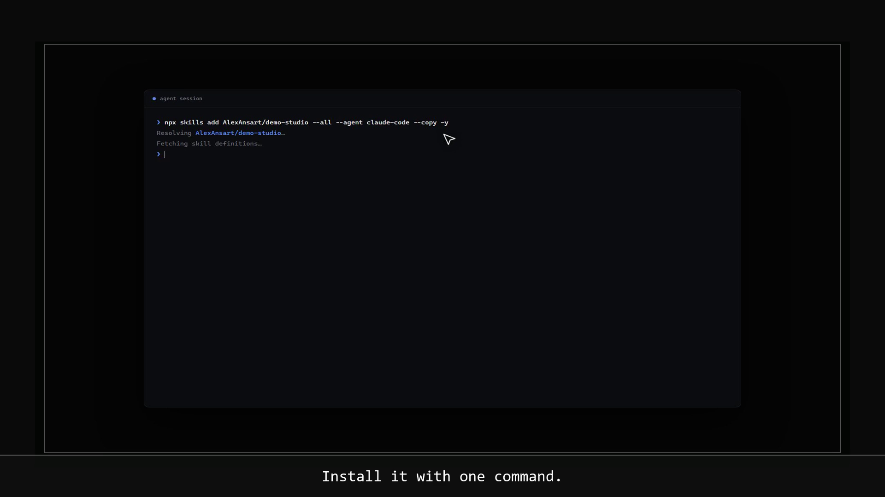
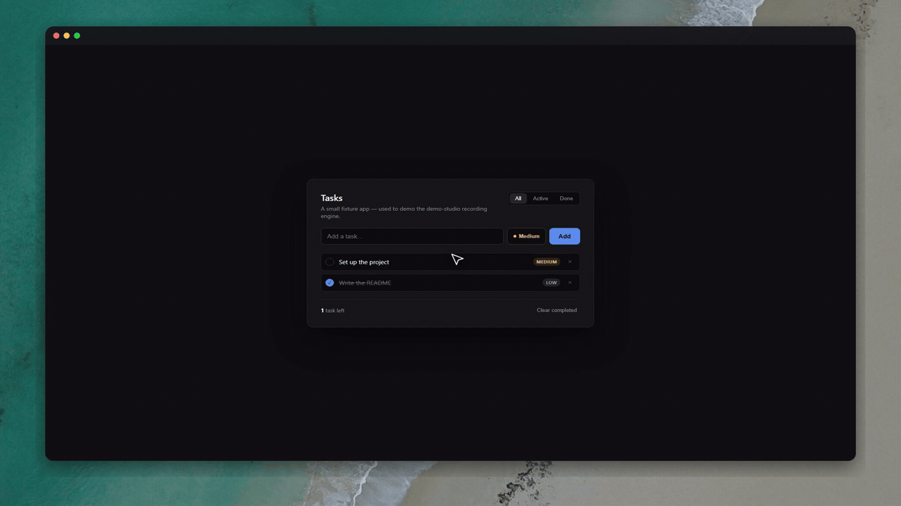

# demo-studio

**Polished product demos — recorded by your AI agent.**

No video editor. No manual screen recording. Tag a skill in Cursor or Claude Code, describe what to show, and get back a zoom-composited `.mp4` with optional voiceover and burned-in captions.

The launch clip below was **produced by this repo's own [`produce-video`](skills/produce-video/SKILL.md) skill** — narrated, captioned, zero hand-editing. Click the image to play (41s, audio on):

[](https://github.com/AlexAnsart/demo-studio/blob/main/docs/assets/promo.mp4)

The preview it delivers inside that session was recorded the same way with [`film-demo`](skills/film-demo/SKILL.md):



---

## Why not just screen-record?

| Manual recording | demo-studio |
|------------------|-------------|
| You drive every click | Agent drives Playwright from a script |
| Zooms added in post | Smart focus/wide camera baked in |
| Voice + sync in a DAW | ElevenLabs + Whisper alignment automated |
| Every take is different | Guardrails + verify loop before delivery |

Works on **any web app** — Vite, Next.js, your own stack. One install, five skills.

---

## Quick start

**1. Install** (in your project, or clone this repo to try the [hello fixture](examples/hello-demo)):

```bash
npx skills add AlexAnsart/demo-studio --all --agent cursor --copy -y
```

**2. Set up once** — in Cursor chat:

> @demo-setup Set up demo-studio for this project.

**3. Record** — silent demo:

> @film-demo Record a silent demo of the signup flow. Save to `demos/signup/demo.mp4`.

Or full narrated pipeline (needs `ELEVENLABS_API_KEY` in `.env`):

> @produce-video Produce a narrated demo of creating a task — voiceover and captions — save to `demos/create-task/demo.mp4`.

The agent writes the beat script, records the browser, composes zooms, runs quality checks, and delivers the file. You don't run ffmpeg or Playwright commands yourself.

---

## Skills

| Skill | Role |
|-------|------|
| [demo-setup](skills/demo-setup) | One-time project config — dev server, auth, narration, scaffolds your first demo |
| [film-demo](skills/film-demo) | Silent capture — Playwright, cursor, zone zooms, speed-ups, styled frame |
| [narrate](skills/narrate) | ElevenLabs voiceover from your script |
| [sync-narration](skills/sync-narration) | Whisper alignment, pause insertion, caption burn-in |
| [produce-video](skills/produce-video) | End-to-end orchestrator — all of the above in one run |

---

## How it works

```
Your prompt  →  script.md (Say + Show beats)
                    ↓
              narrate (optional)  →  narration.mp3
                    ↓
              film-demo           →  silent .mp4 (smart zooms, guardrails)
                    ↓
              sync-narration      →  final .mp4 + captions
```

**Voice comes first** when narrated: the video adapts to the voice, not the other way around.

---

## Requirements

| Tool | Needed for |
|------|------------|
| Node.js 18+ | Recording engine |
| [ffmpeg](https://ffmpeg.org/download.html) + `ffprobe` | Compose, sync, captions |
| Python 3.9+ | Narration sync (Whisper) |
| [ElevenLabs](https://elevenlabs.io) API key | Voiceover only — silent mode works without it |

Copy [`.env.example`](.env.example) → `.env` for `ELEVENLABS_API_KEY` and optional demo login credentials.

---

## Try the hello fixture

No dev server required — use this repo directly:

```bash
npx skills add AlexAnsart/demo-studio --all --agent cursor --copy -y
```

Then in Cursor:

> @demo-setup Set up demo-studio. Use the hello fixture in `examples/hello-demo/app`.
>
> @film-demo Record a silent demo: type "Ship the v1 release", click Add, show the new task. Save to `examples/hello-demo/output/demo.mp4`.

---

## Configuration

All tunables — cursor style, zoom padding, speed-ups, frame preset, voice — live in `demo.config.json`. See [docs/CONFIG.md](docs/CONFIG.md).

---

## License

MIT · [AlexAnsart/demo-studio](https://github.com/AlexAnsart/demo-studio)
